# E-commance website(Goodgiving)

## contents
1. Identification of the problem you are trying to solve by building this particular marketplace app.(R7)
2. Why is it a problem that needs solving?(R8)
3. A link (URL) to your deployed app (R9)
4. A link to your GitHub repository (R10)
5. Description of your marketplace app (website)(R11)
6. User stories for your app(R12)
7. Wireframes for your app(R13)
8. An ERD for your app(R14)
9. Explain the different high-level components (abstractions) in your app(R15)
10. Detail any third party services that your app will use(R16)
11. Describe your projects models in terms of the relationships (active record associations) they have with each      other(R17)
12. Discuss the database relations to be implemented in your application(R18)
13. Provide your database schema design(R19)
14. Describe the way tasks are allocated and tracked in your project(R20)


## 1.Identification of the problem you are trying to solve by building this particular marketplace app.(R7)
The advent of the mobile Internet era has really begun to make donation and sharing an integral part of our lives,and the era of mobile social welfare is coming.

The power of mobile new Internet is booming in the Chinese public welfare sector. Whether it is the public or the public welfare organizations, the public media has consciously and unconsciously participated in the transformation of China's public welfare undertakings. With the increasing number of media, the Internet era has changed to the era of mobile Internet. The propaganda and dissemination of traditional philanthropy is gradually changing. The philanthropy needs to be more popular and transparent. How can philanthropy be understood by more people and how to adapt to the needs of the current people?

In the traditional way of working, charities will pool the funds raised from individual donors and choose areas that have important value for social development: health, poverty alleviation, culture, etc., responsible for the significance, value, implementation of the project. Assessment and supervision of effects and other aspects. The charity will inform the donor through various channels regarding the project, implementation effect and spending rules it chooses. This way of reviewing donations through intermediaries is not easy to trust the donors.


## 2.Why is it a problem that needs solving?(R8)

The purpose of the Goodgiving is to remove the intermediary. The website itself serves as a donation platform. After the local community government or related agency company publishes the donation project, people can browse directly on the website. The amount of the donation of the website management organization is controlled by everyone. Scope, unlike a donation website, donors do not need to make monthly donations. Goodgiving's donations go out completely and voluntarily. After understanding the specific story and background of the project, the donor class randomly chooses to donate a small amount. Donors can also directly communicate with the organization that initiated the project to learn more about the project and decide whether to make a donation. Without third-party intermediaries, donors are more likely to believe in the authenticity and reliability of donations. Even after learning about the project background, you can register as a volunteer on the website.


I believe that with the promotion of Goodgiving, more and more public welfare projects hope to use the new media to let more power to pay attention to public welfare and promote the development of public welfare. More and more non-profit organizations hope to change the previous official authority image and turn public welfare into a career that everyone can participate in.


The changes brought about by the Goodgiving online donation model are not limited to expanding the source of donations. The high degree of transparency makes the intermediaries almost invisible, allowing the recipients to deal directly with the sponsors. This form of approaching SNS not only allows donors to feel a sense of personal meaning from the freedom of choice but also allows recipients to feel support from the community rather than a string of numbers added to the account.


## 3.A link (URL) to your deployed app(R9)

```txt
 https://goodgiving.herokuapp.com/
```


## 4.A link to your GitHub repository(R10)

```txt
 https://github.com/Caiheng111/rails-marketplace
```


## 5.Description of your marketplace app (website)(R11)

  * ***Purpose***

    The purpose of the Goodgiving is to remove the intermediary. The website itself serves as a donation platform. After the local community government or related agency company publishes the donation project, people can browse directly on the website. The amount of the donation of the website management organization is controlled by everyone. Scope, unlike a donation website, donors do not need to make monthly donations. Goodgiving's donations go out completely and voluntarily. After understanding the specific story and background of the project, the donor class randomly chooses to donate a small amount. Donors can also directly communicate with the organization that initiated the project to learn more about the project and decide whether to make a donation. Without third-party intermediaries, donors are more likely to believe in the authenticity and reliability of donations. Even after learning about the project background, you can register as a volunteer on the website.


* ***Functionality / features***

1. Login and sign up function (multiple users)

    User gem devises to set the multiple user authentication, user can sign up as a donor/volunteer or an organization. Once they signup, they can log in and update their password.
    * When signing up as an organization（as a new organization）, the navbar will show the link profile, after clicking that link, the organization can add their profile information.
    * A dropdown menu will show out (including post a project/All projects/edit profile/Message), once the organization adds their profile information on the website.
    * When sign up ad a donor, the donor can send messages to the organization who post that project and donate money.
    * When signing up as a volunteer, the navbar will show the link profile, after clicking that link, the volunteer can add their profile information.


2. authentication for donating and sending a message

    * User who has not log in or sign up can't donate and send messages to each other. they only can browse the website


3. authentication and security for user and project information

    * User only can access to their only profile or edit(delete) their own projects. if they try to access other user's information, they will be led to the home page


4. Searching, sorting and filtering capability

    * In the projects listing page, user can search the project by keyword
    * In the projects listing page, user can choose projects by location listing
    * In the projects listing page, user can choose projects by project category listing


5. page separation function

    * Used gem 'will-pagination' to divide the projects


6. show the raised percentage in the project

    * User can see the raised percentage in the project


7. Internal user messaging system within the app
    * User can send message each other when they logged in


8. A payment system for your product. (e.g. Stripe)

    * Setted Stripe to finish the payment function


9. Admin user account for the admin user to administer the site

    * Add the admin user authentication to manage the website information
    * Admin user can edit or delete all projects information and user profile information

10. responsive layout for phone size

11. (authentication）The user need login first when they want to send a message and donate


  * ***Sitemap***

   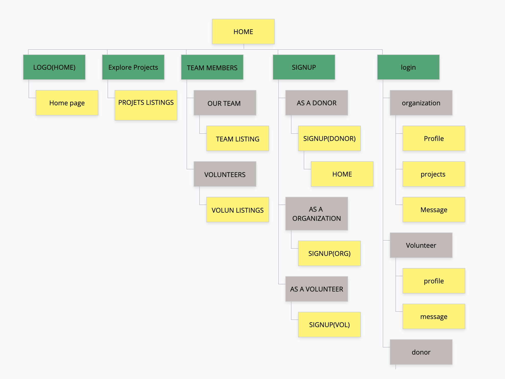


  * ***Screenshots***


  

  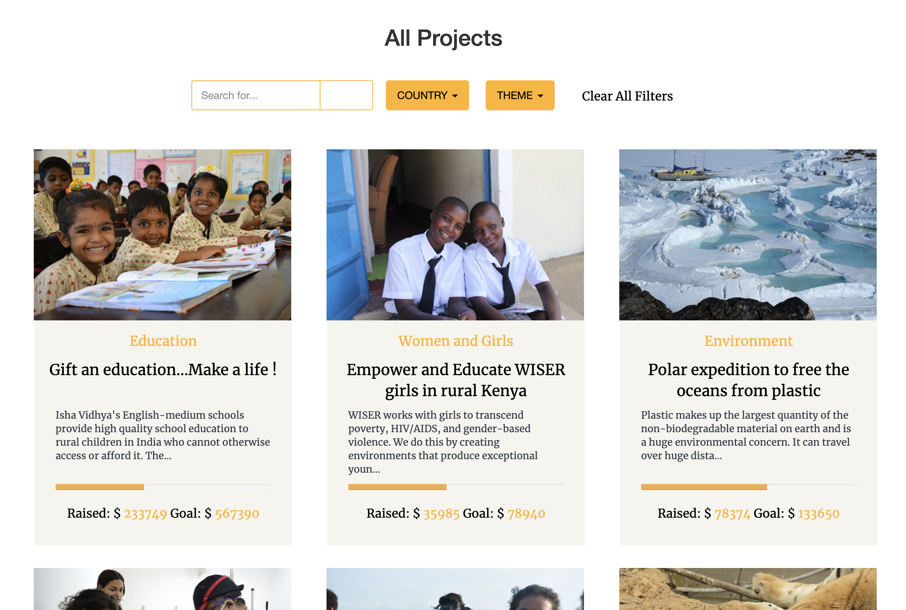

  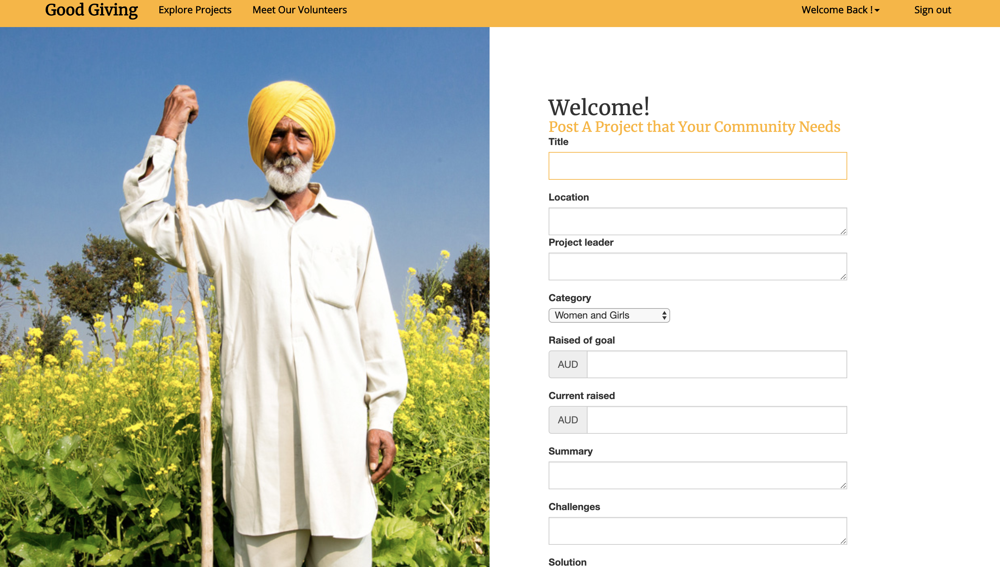

  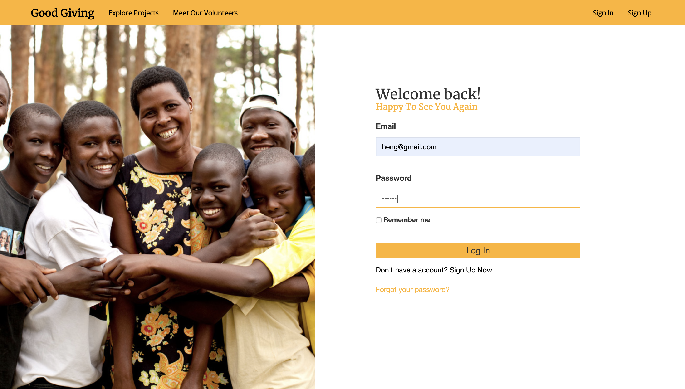

  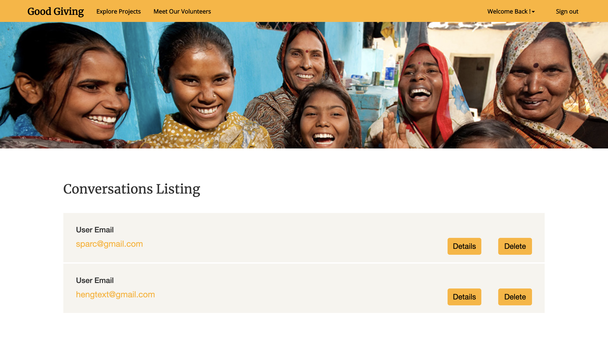

  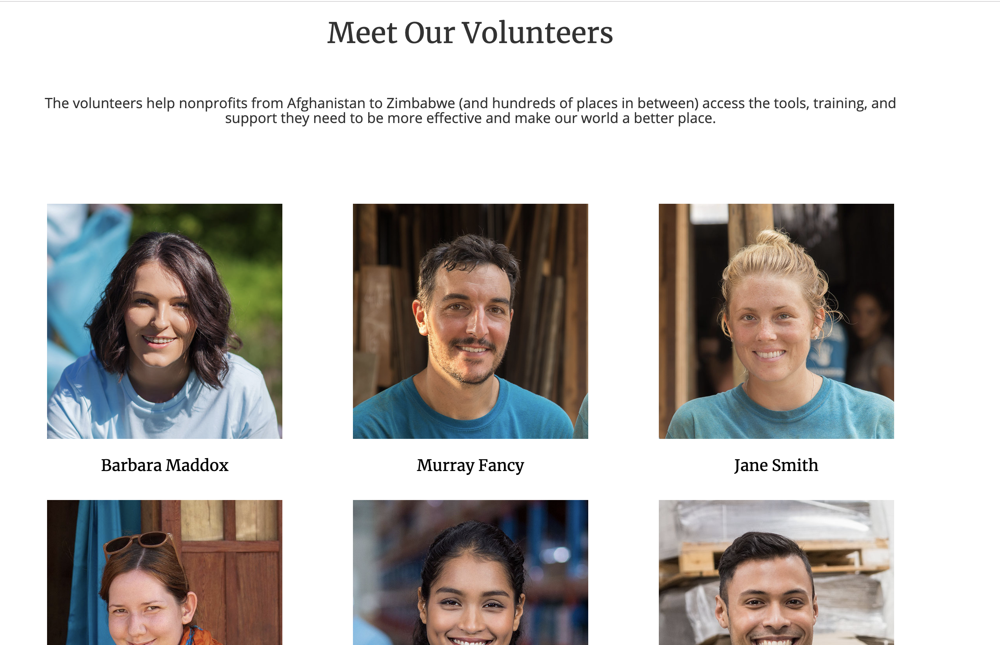


  * ***Target audience***

    * Organizations or Communities who need to raise money for local people.
    * Donor who are happy to donate a little money to the commmunities which need help.
    * Volunteer who are happy to join a project to offer help.


  * ***Tech stack***

    *  HTML5
    *  CSS3
    *  Ruby on rails 5
    *  jQuery
    *  AWS s3
    *  Heroku
    *  Ruby gems
    *  Bootstrap 4
 

## 6.User stories for your app(R12)


* ***user(Organizations)***

  * As organizations or communities, they can sign up as a website user and can login and update their password.
  * As organizations or communities, they can add and edit their basic profile information.
  * As organizations or communities, they can post a project to raise money for their local people,and they also can donate to other communities for helping each other.
  * As organizations or communities, they can message to the donor or volunteer to give more details about this project and reply to any messages from the donors and volunteers.
  * As organizations or communities, they can edit and delete their projects on the website.

* ***user(Donors)***

  * As donors, they can sign up as a website user and can log in and update their password.
  * As donors, they can see all the projects on the website.
  * As donors, they can send messages to the organization who post that project to ask project details or other details.
  * As donors, they can donate more than one project at one time.
  

* ***user(Voluntters)***

  *  As volunteers, they can sign up as a website user and can login and update their password. 
  *  As volunteers, they can add and edit their basic profile information.
  *  As volunteers, they can join a project to be a volunteer.(Required review and approval by website regulators    and corresponding organizations )


## 7.Wireframes for your app(R13)

```txt
 1.Projects information page
```
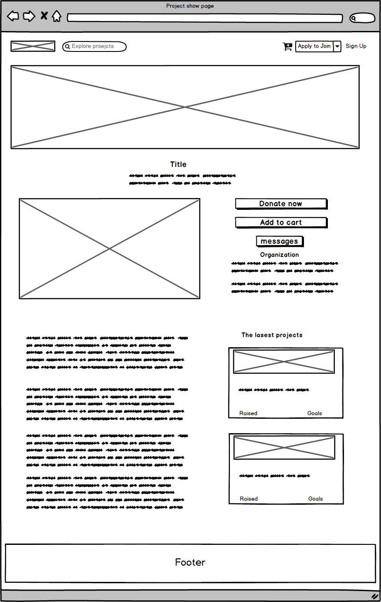


```txt
 2. Login in and other silimar form page (template)
```

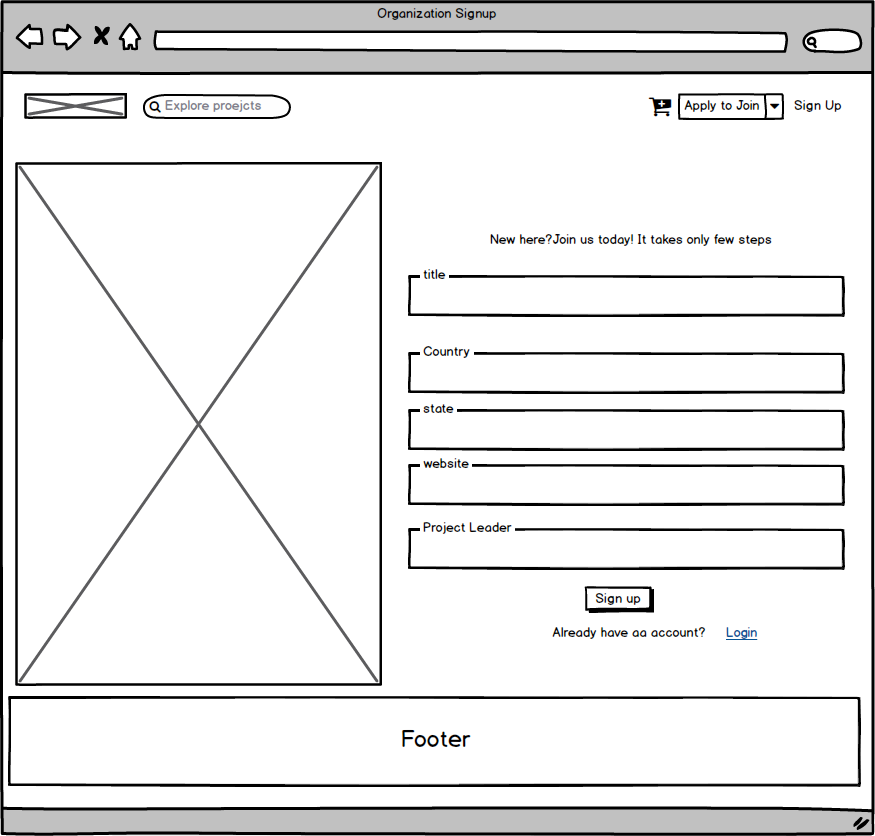

```txt
 3. Message board page
```

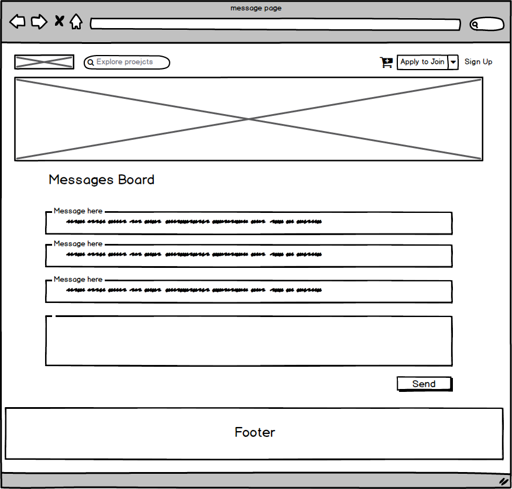

```txt
 4. projects listing page
```

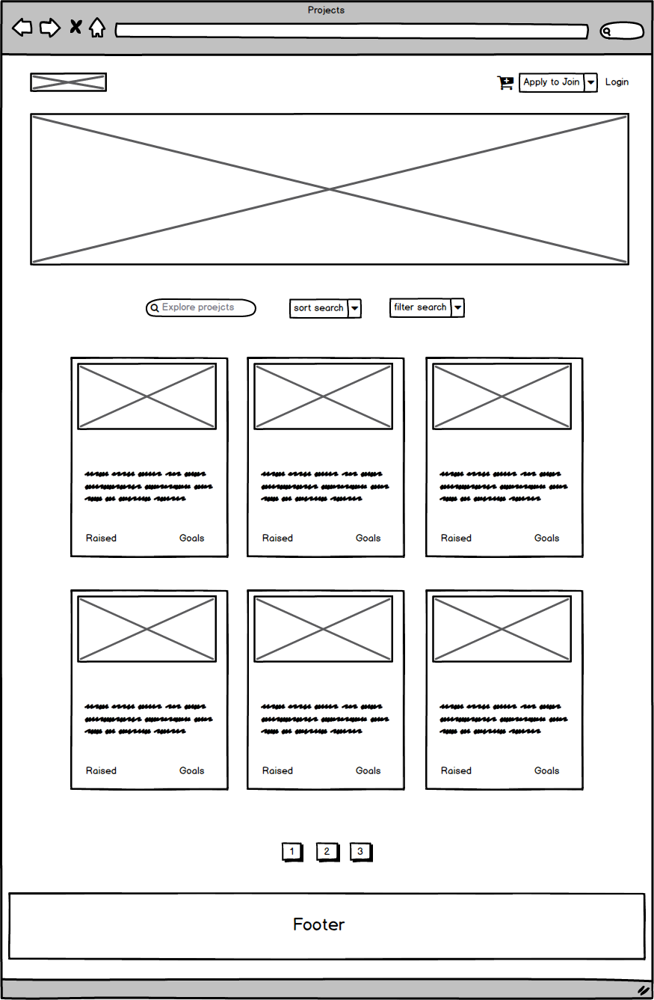

```txt
 5. responsive page 1
```

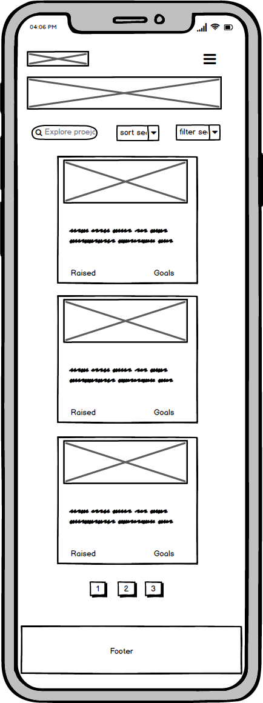

```txt
 6. responsive page 2
```

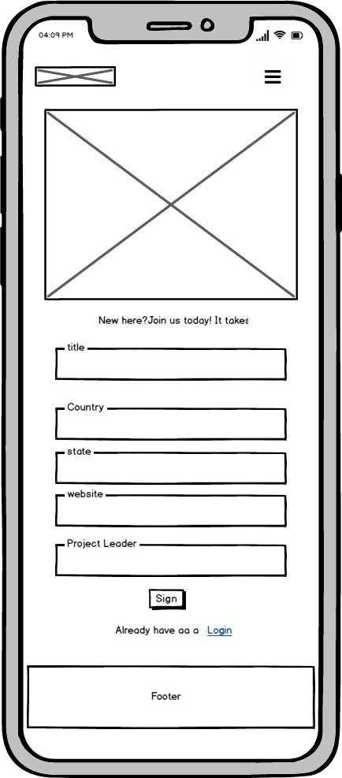


## 8.An ERD for your app(R14)

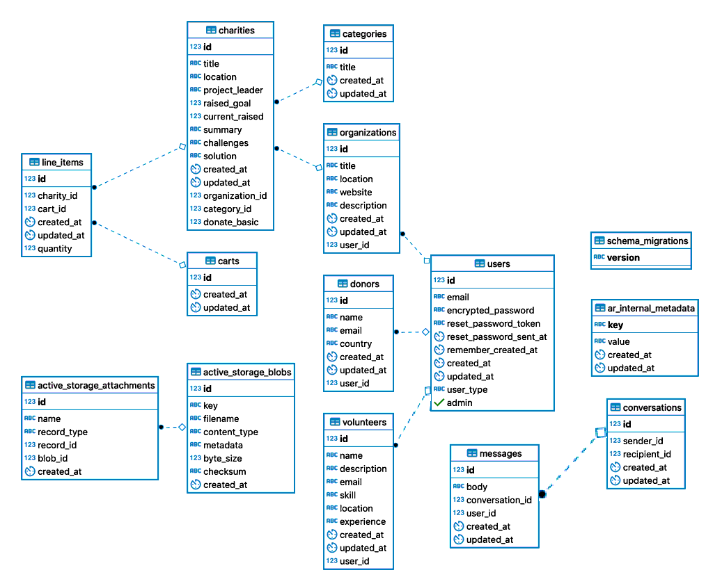


## 9.Explain the different high-level components (abstractions) in your app(R15)


* ***Rails Routes***
  * In my marketplace, I insert a snippet like the following:, which realy help me save time to write route code
    - resources :line_items
    - resources :carts
    - resources :charities


   * in Rails ultimately gives you the following:
    - get 'charities' => 'charities#index'
    - get 'phocharitiestos/new' => 'charities#new'
    - post 'charities' => 'charities#create'
    - get 'charities/:id' => 'charities#show'
    - get 'charities/:id/edit' => 'charities#edit'
    - patch 'charities/:id' => 'charities#update'
    - delete 'charities/:id' => charities#destroy


* ***Rails’ Action View Form Helper***

    ```txt
      <%= form_with(model: @volunteer, local: true) do |form| %> ......
      created form fields like text_field, text_area, file_field
        made selection boxes
    ```

* ***Rails before_action***
    In each controller I have some before_action calls that check the appropriate level of permissions for a given CRUD operation.for example:

    ```txt
      before_action :set_charity, only:[:edit, :update, :show, :destroy]
      before_action :authenticate_user!, :except => [:listings, :show]
    ```
    ```txt
      before_action :set_line_item, only: [:show, :edit, :update, :destroy]
      before_action :set_cart, only: [:create]
      before_action :authenticate_user!
    ```

    ```txt
      before_action :find_conversation
    ```


* ***Rails Active Records(CRUD: Reading and Writing Data)***

 * The rials console provide a very convenient way to access to teh database.For example:
    
    ```txt
      users = User.all
      User.create()
      User.delete_all
      user = User.find_by(name: 'David')
    ```


 * Active Record allows me to validate the state of a model before it gets written into the database.belows are some validations I used in my app:
   
    ```txt
      validates :title, presence: true, length: { minimum: 3, maximum: 50 }
      validates :summary, :challenges, :solution,  presence: true, length: { minimum: 10, maximum: 1000 }
    ```
    ```txt
      validates :name, presence: true, length: { minimum: 3, maximum: 20 }
      validates :description, presence: true, length: { minimum: 10, maximum: 1000 }

      VALID_EMAIL_REGEX = /\A[\w+\-.]+@[a-z\d\-.]+\.[a-z]+\z/i
      validates :email, presence: true, length: { maximum: 105 },
                uniqueness: { case_sensitive: false },
                format: { with: VALID_EMAIL_REGEX }
    ```
    ```txt
      validates_uniqueness_of :sender_id, scope: :recipient_id
    ```
    ```txt
      validates_presence_of :body, :conversation_id, :user_id
    ```


* ***Rails if consition (added in html)***

 * The html.erb file in rails help me make the navbar link changable, for emaple, this if(end) condition can show the different links on navbar when the user logged_in or not.
    
    ```txt
        <% if user_signed_in? && current_user.user_type=="organization" %>
          <% if  current_user.organization !=nil && current_user.organization.title !=nil %>
          <li class="dropdown">
            <a href="#" class="dropdown-toggle" data-toggle="dropdown" role="button" aria-haspopup="true" aria-expanded="false">Welcome Back !<span class="caret"></span></a>
              <ul class="dropdown-menu">
                <li><%= link_to "Post a Project", new_charity_path%> </li> 
                  <li role="separator" class="divider"></li>
                <li><%= link_to "All Projects", charities_path%> </li>
                  <li role="separator" class="divider"></li> 
                <li><%= link_to "Edit Your Profile", edit_organization_path(current_user.organization) %> </li> 
                  <li role="separator" class="divider"></li> 
                <li> <%= link_to "Messages", conversations_path %></li>
              </ul>
              <li><%= link_to "Sign out", destroy_user_session_path, method: :delete %> </li> 
          </li>
          <% else %>
            <li> <%= link_to "Profile", organizations_path %></li>
            <li><%= link_to "Sign out", destroy_user_session_path, method: :delete %> </li> 
          <% end %>
    ```


## 10.Detail any third party services that your app will use(R16)

* ***AWS(S3 buket)***

    1. AWS (Amazon Web Services) has a solution we can use called S3. S3 is for data storage that you can access via a url, which can be usered to store the images in my rails proejct.

    *  sign in to AWS
    *  Go to S3 and create a new bucket
    *  Enter a unique bucket name and make sure your region is set to Asia Pacific (Sydney)
    *  We need to setup a new user that will have access to this bucket.
    *  enter a username and unique bucket name.
    *  Copy down your access id and secret once your create a user sucessfully
    * When it opens up the file add in our keys, save and close.(EDITOR="code --wait" rails credentials:edit)
    * bundle add aws-sdk-s3 and amend files in (config/environments/development.rb & config/environments/           production.rb)
    * When it opens up the file add in our keys, save and close.(EDITOR="code --wait" rails credentials:edit)


* ***Heroku deploy***

    * cd Goodgiving
    * git init
    * Initialized empty Git repository in .git/
    * git add .
    * git commit -m "My first commit"
    * heroku create
    * git push heroku master
    * heroku rake:db migrate
    * heroku apps:rename goodgiving

 * ***Stripe Payment***

    * bundle add stripe
    * Login stripe and set API key
    * Add the API key in rials (EDITOR="code --wait" rails credentials:edit)
    * using Stripe’s checkout to charge our users' credit card
    * Add webhook to provide information


## 11.Describe your projects models in terms of the relationships (active record associations) they have with        each other(R17)


The relationships have in my proejct models

* ***has_one association***

 1. One organization only can has one user account, so a forienge key was added to the user organization
      -  The organization table has a column (user_id)
      - Belowns are code are added in organization table

          ```txt
            t.bigint "user_id"
            t.index ["user_id"], name: "index_organizations_on_user_id"
          ```

      - Belowns are code are added in organization.rb  model file

          ```txt
          belongs_to :user
          ```
      - Belowns are code are added in organization.rb  model file

          ```txt
          has_one :organization
          ```


 2. One Volunteer and one donor also only can has one user account, so a forienge key was added to the user organization
      -  The organization table has a column (user_id)
      - Belowns are code are added in organization table

          ```txt
          t.bigint "user_id"
            t.index ["user_id"], name: "index_volunteers_on_user_id"
          ```

      - Belowns are code are added in volunteer.rb  model file
          ```txt
          belongs_to :user
          ```
      - Belowns are code are added in organization.rb  model file

          ```txt
          has_one :volunteer
          ```

* ***has_many association***


 1. One category can including many charity projects,
      -  The chairty table has a column (category_id)
      - Belowns are code are added in charity table

          ```txt
              t.index ["category_id"], name: "index_charities_on_category_id"
          ```

      - Belowns are code are added in charity.rb  model file
          ```txt
          belongs_to :user
          ```
      - Belowns are code are added in category.rb  model file

          ```txt
          has_many :charities
   
         ```

 2. One organization can including many charity projects(One organization or community can post many projects to help local people)
      -  The chairty table has a column (organization_id) 
      - Belowns are code are added in charity table

          ```txt
              t.index ["organization_id"], name: "index_charities_on_organization_id"
          ```

      - Belowns are code are added in charity.rb  model file
          ```txt
          belongs_to :organization
          ```
      - Belowns are code are added in organization.rb  model file

          ```txt
          has_many :charities
          ```
 3. One charity could be added to the donation listing many times(which means many donor can add this charity to listing to donate money), so
      -  The line_items table has a column (charity_id) 
      - Belowns are code are added in line_items table

          ```txt
              t.index ["charity_id"], name: "index_line_items_on_charity_id"
          ```

      - Belowns are code are added in line_item.rb  model file
          ```txt
          belongs_to :charity
          ```
      - Belowns are code are added in chairty.rb  model file

          ```txt
          has_many :line_items
          ```
 4. One cart(donation listing) could be added to the donation listing many times(which means many donor can add this charity to listing to donate money), so
      -  The line_items table has a column (cart_id) 
      - Belowns are code are added in line_items table

          ```txt
              t.index ["cart_id"], name: "index_line_items_on_cart_id"
          ```

      - Belowns are code are added in line_item.rb  model file
          ```txt
          belongs_to :cart
          ```
      - Belowns are code are added in cart.rb  model file

          ```txt
          has_many :line_items
          ```
 5. One conversation can including many messages, so
      -  The messages table has a column (conversation_id) 
      - Belowns are code are added in messages table

          ```txt
              t.index ["conversation_id"], name: "index_messages_on_conversation_id"
          ```

      - Belowns are code are added in message.rb  model file
          ```txt
          belongs_to :conversation
          ```
      - Belowns are code are added in conversation.rb  model file

          ```txt
          has_many :messages
 
          ```
 5. One user can including many messages, so
      -  The messages table has a column (user_id) 
      - Belowns are code are added in messages table

          ```txt
               t.index ["user_id"], name: "index_messages_on_user_id"
          ```

      - Belowns are code are added in message.rb  model file
          ```txt
          belongs_to :user
          ```
      - Belowns are code are added in user.rb  model file

          ```txt
          has_many :messages
          ```


## 12.Discuss the database relations to be implemented in your application(R18)

* ***Relation between table User and organizations/ volunteers/ donors***

  * The users table has the primary key
  * the organization/ volunteer/ donor model has the user_id (foreign key)

* ***Relation between table Organizations and charities***

  * The organization table has the primary key
  * the charity model has the organization_id (foreign key)

* ***Relation between table categories and charities***

  * The category table has the primary key
  * the charity model has the category_id (foreign key)

* ***Relation between table line_items and charities***

  * The charity table has the primary key
  * the line_items model has the charity_id (foreign key)

* ***Relation between table line_items and carts***

  * The cart table has the primary key
  * the line_items model has the cart_id (foreign key)

* ***Relation between table users and messages***

  * The users table has the primary key
  * the messages model has the user_id (foreign key)

* ***Relation between table users and messages***

  * The users table has the primary key
  * the messages model has the user_id (foreign key)


## 13.Provide your database schema design(R19)

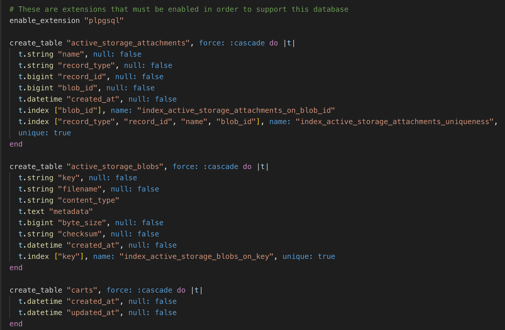

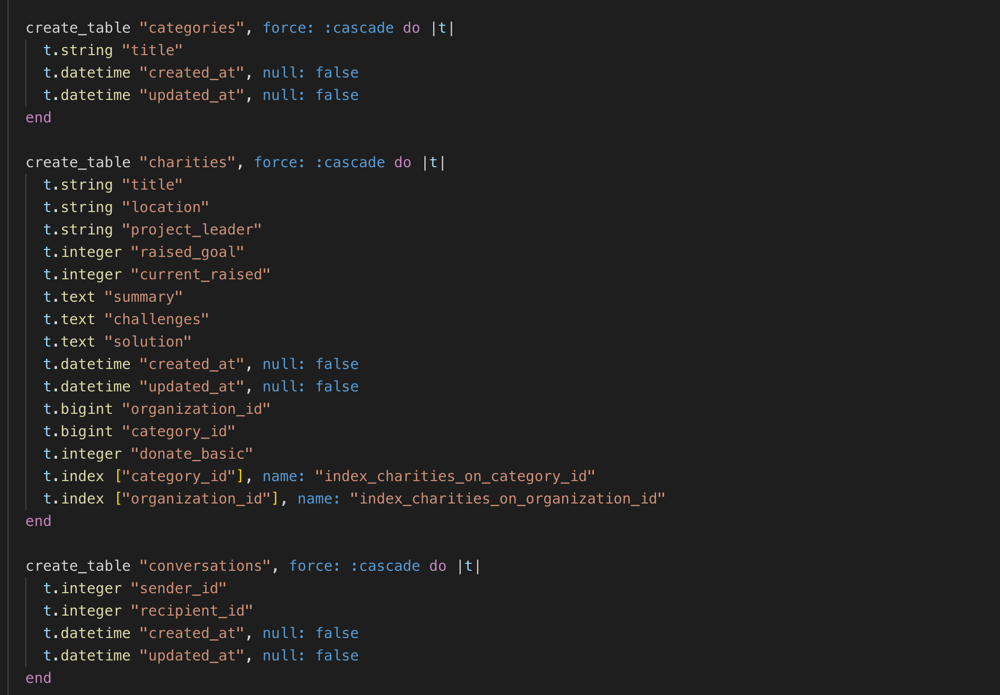

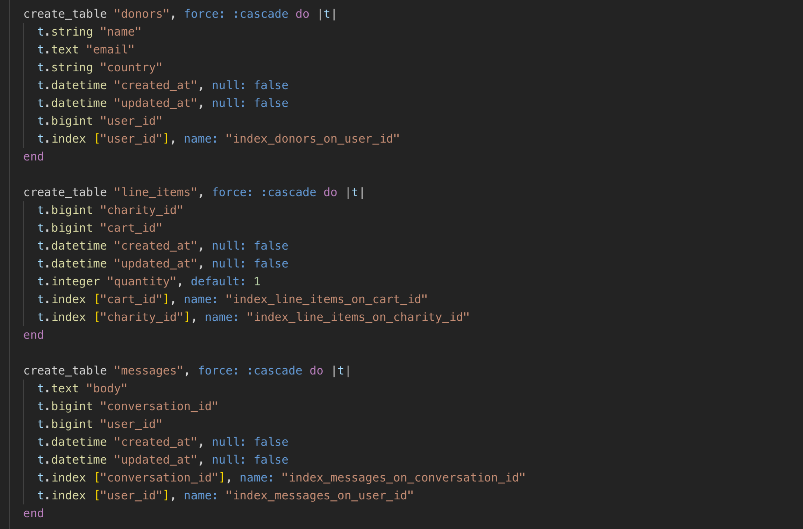

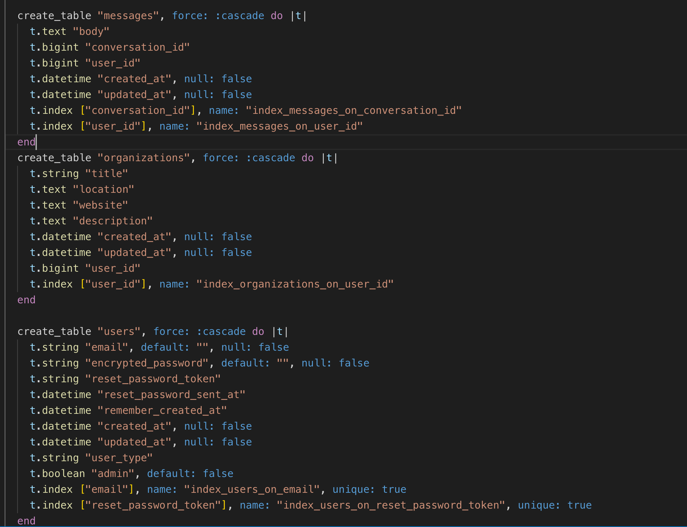

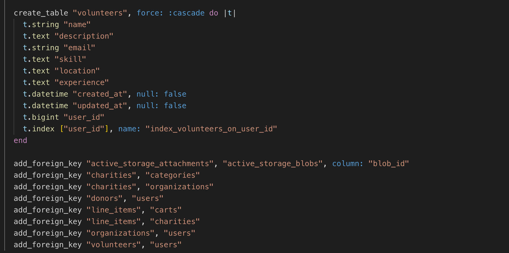


## 14. Describe the way tasks are allocated and tracked in your project(R20)

 * ***Plan Management(Basic steps)***

    * Decide a idea
    * Graw the ERD draft
    * Finish the first ERD
    * Look for some website design to inspire the website layout
    * check all relationship between models
    * Add devise to create multiple users
    * Add organization , volunteer  and donor models
    * Add organization , volunteer  and donor controllers and views
    * Add navbar
    * Add organization profile page and projects page
    * Add voluntter profile page 
    * Add charities model and controllers
    * Add the cart function and stripe function
    * Add message board function
    * Add sort and filter fucntion
    * Add bootstrap to design layout(responsive)
    * heroku deploy and enter data
    * check all function if work in after deployed
    * Add css media query to layout responsive


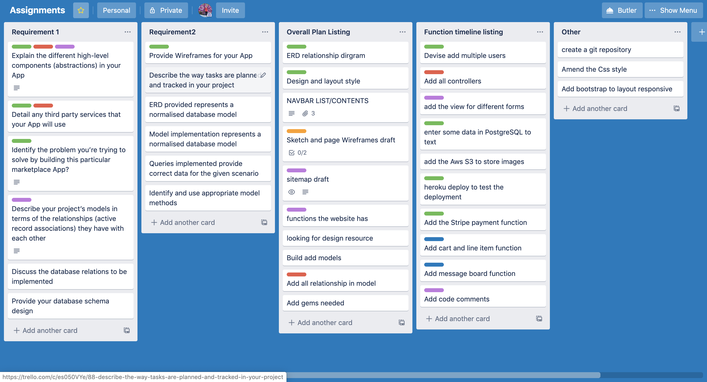

